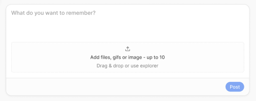
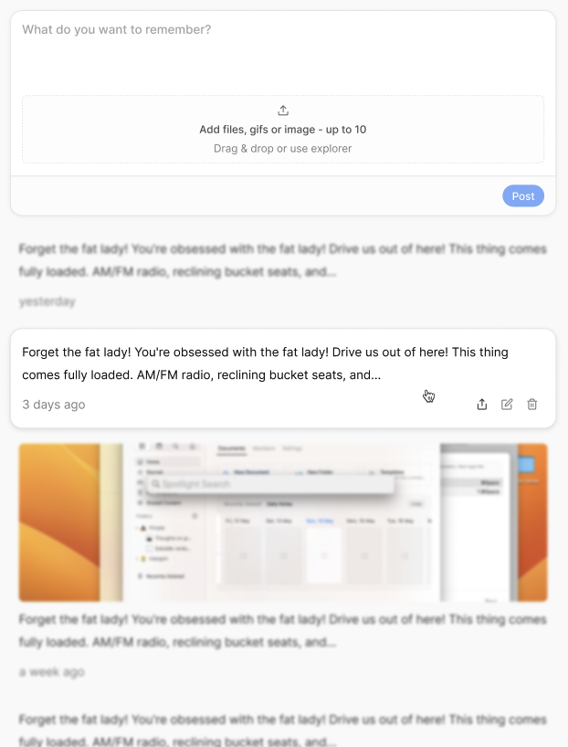
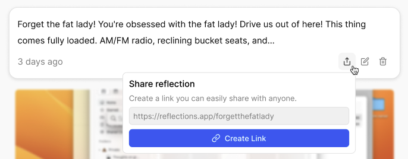

# Reflections

## Decision rule

Product owner must be consulted before meaningful design decisions.

If decision changes: core interaction, information architecture, visual language, sharing model, Reflection structure, navigation, composer behavior, terminology — **ask first**.

Technical implementation choices can be made pragmatically when they don't change product behavior. When uncertain, prefer simplest implementation and flag decision.

---

## What is this?

An iteration of [daily-reflections](https://github.com/jordihoven/daily-reflections)

Personal memory app built on AT Protocol.

Closer to private diary / personal Instagram than traditional social network.

A "reflection" is a record that can contain writing plus attached files.

Examples:

- Short reflection + photos
- Memory + audio
- Note + GIF
- Markdown/plain-text file
- Collection of files dropped onto composer

User writes for their future self, not an audience.

Inspired by Marcus Aurelius — thoughts worth recording even when never intended to be published. Seneca's habit of reflecting on his day before bed. Stoic practice: not a diary or journal, but _reflection_.

---

## Product thesis

> A personal memory layer for the open social web.

ATProto is interesting because reflections become native records in the user's own repository — not data trapped inside an app.

The app is a beautiful interface over the user's data.

---

## Principles

1. **Memory first** — user records life for themselves
2. **Social second** — social emerges from data, doesn't define experience
3. **User-owned data** — reflections live in user's ATProto repository
4. **No unnecessary infrastructure** — don't create DB/services when ATProto provides the primitive
5. **Be honest about privacy** — ATProto records are public, never imply protocol-level confidentiality
6. **Interoperability** — reflection record should be understandable by other ATProto clients
7. **Simple capture** — reflecting should be fast and frictionless
8. **Smallest real thing first** — prove the core loop before building imagined futures

---

## ATProto privacy constraint

ATProto repositories are public by design. No general-purpose private record model exists yet.

**Do not describe reflections as private.**

For v1: reflections stored as ATProto records are public protocol data.

However, product UX can still be personal-first:

- no follower pressure
- no likes
- no algorithmic discovery
- no public feed by default
- no public profile unless we build one

"Private-feeling" is okay. "Private/confidential" is not.

Deletion cannot promise complete erasure — records/blobs may propagate to relays, AppViews, caches.

---

## Core object: Reflection

ATProto record. Conceptually:

```
Reflection
├── text / composition
├── createdAt
└── attachments[]
    ├── image
    ├── video
    ├── audio
    ├── gif
    └── arbitrary file
```

**Lexicon NSID:** `app.reflections.reflection`

**v1 schema:**

- `text` — string, max 1000 characters, optional (reflection can be attachments-only)
- `createdAt` — ISO 8601 datetime, set automatically, no user override
- `attachments` — array of blob refs, no captions in v1

Not editable in v1. User deletes and recreates instead.

---

## v1 scope

**Build:**

- Create reflections (text + attachments)
- View reflections (timeline/feed)
- Delete reflections (simple dialog: "Delete this reflection? This cannot be undone.")
- ATProto OAuth authentication

**Do not build:**

- Private storage layer / custom PDS / relay
- Social features (likes, followers, notifications, DMs, public discovery)
- Recommendation algorithm / search / analytics
- Complex permissions
- AI features
- Mobile app
- Sharing / public profiles

Social features may come later. Do not build social mechanics just because ATProto makes them possible. Product should remain useful as purely personal experience.

---

## Technical direction

### Stack

- **Next.js** — app
- **TypeScript** — everything
- **Tailwind CSS** — styling
- **@atproto/oauth-client-node** — login/session
- **@atproto/api** — ATProto API calls
- **Custom Lexicon** — Reflection records

### Storage

No application database for v1. No S3/object storage.

Use user's ATProto PDS for:

- Reflection records
- blobs / attached files

PDS/blob limits vary by implementation. App should handle rejection gracefully when limits are exceeded. Show user-friendly error with limit info when available.

### Backend

Avoid custom backend unless OAuth requires server-side handling. Goal: as little infrastructure as possible.

### Authentication

ATProto OAuth. Authenticate against user's ATProto identity/PDS. No separate account/password system.

Permissions needed:

- reading/writing Reflection collection
- uploading blobs

### Lexicon

Custom ATProto Lexicon for Reflections. Designed for interoperability. Start with smallest useful record.

**v1 fields:**

- `text`
- `createdAt`
- `attachments`

### Blobs

Files uploaded as ATProto blobs. Reflection record references them.

```
Reflection record → references → Blob → stored by → User's PDS
```

Support arbitrary files where PDS allows. Prioritize for v1: images, GIFs, audio, text/Markdown, common video. No custom media processing unless necessary.

---

## v1 acceptance criteria

Core loop must work end-to-end before building full UI:

1. Login with ATProto OAuth
2. Identify user's DID/PDS
3. Upload file as blob
4. Create Reflection record referencing blob
5. Read Reflection back and render it
6. Delete Reflection
8. Confirm with different ATProto account/PDS if practical

If this works, fundamental architecture is proven.

---

## Resolved for v1

- **NSID:** `app.reflections.reflection`
- **Text limit:** 1000 characters
- **Captions:** none in v1
- **Editing:** not in v1 — delete and recreate
- **Dates:** `createdAt` auto-set, no user override
- **Delete UX:** simple confirmation dialog
- **Domain:** TBD, localhost for now

## Future

See [future.md](future.md) for deferred features and open questions. Do not resolve or build these without checking with product owner.

---

## Design

See [design-tokens.md](design-tokens.md) for colors and typography.

### Figma components / screenshots

The main element users will interact with is the 'Composer':



Reflections fade into the background, similar to scrolling through social media posts, but blurred as to not distract. Only once tapped (mobile) or hovered (desktop) they reveal:



A reflection has actions: share, edit, delete:



---

## References

- [ATProto Lexicon spec](https://atproto.com/specs/lexicon)
- [ATProto OAuth spec](https://atproto.com/specs/oauth)
- [Developing with Lexicons](https://atproto.com/guides/installing-lexicons)
- [Reading and writing data](https://atproto.com/guides/reads-and-writes)
- [Blobs / images / video](https://atproto.com/guides/images-and-video)
- [OAuth patterns](https://atproto.com/guides/oauth-patterns)
